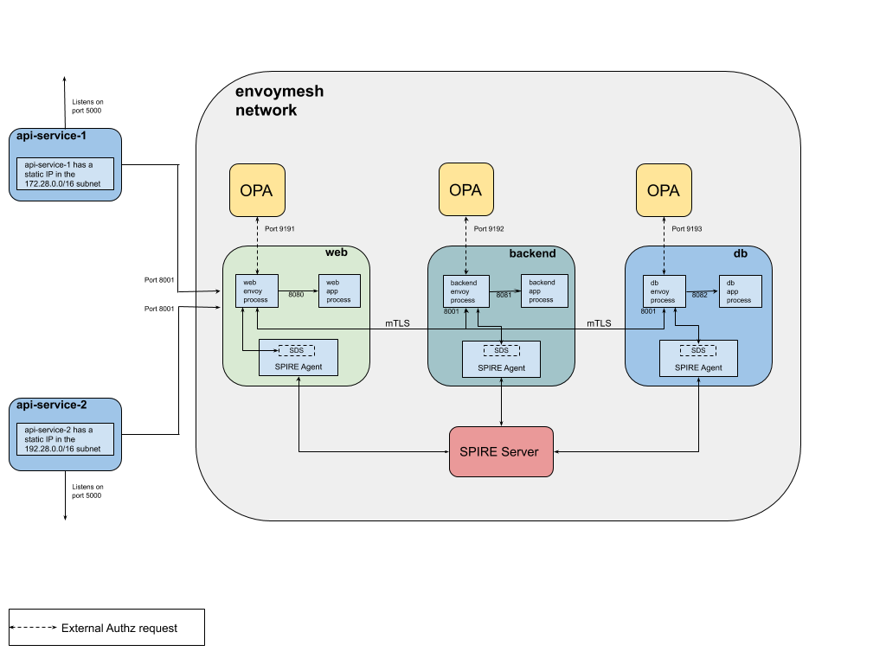

# opa-envoy-ext-authz

OPA-Envoy(v1.10.0) External Authorization Example.

## Overview

Example of using Envoy's [External authorization filter](https://www.envoyproxy.io/docs/envoy/v1.10.0/intro/arch_overview/ext_authz_filter.html) with OPA as an authorization service.

## Example

The example consists of three services (`web`, `backend` and `db`) colocated with a running service Envoy. Each service uses the external authorization filter to call its respective OPA instance for checking if an incoming request is allowed or not.

The `web` service receives all inbound requests from `api-server-1` and `api-server-2` which are deployed in different subnets. The request is forwarded to the `backend` service which then calls the `db` service.

Secure communication between the `web`, `backend` and `db` service is established by configuring the Envoy proxies in each container to establish a mTLS connection with each other. Envoy retrieves client and server TLS certificates and trusted CA roots for mTLS communication from a SPIRE Agent which implements an Envoy [SDS](https://www.envoyproxy.io/docs/envoy/v1.10.0/configuration/secret#). The agent in-turn fetches this information from the SPIRE Server and makes it available to an identified workload. More information on SPIRE can be found [here](https://spiffe.io/spire/overview/).

- Envoy is listening for ingress on port 8001 in each container.
- `api-server-1` and `api-server-2` are flask apps running on port `5000` and `5001` respectively and forward requests to the `web` service.
- `api-server-1` has a static IP in the `172.28.0.0/16` subnet while `api-server-2` has one in the `192.28.0.0/16` subnet.
- OPA is extended with a GRPC server that implements the [Envoy External authorization API](https://www.envoyproxy.io/docs/envoy/v1.10.0/intro/arch_overview/ext_authz_filter.html).
- `data.envoy.authz.allow` is the default OPA policy that decides whether a request is allowed or not.
- Both the GRPC server port and default OPA policy that is queried are configurable.



## Running the Example

### Step 1: Install Docker

Ensure that you have recent versions of `docker` and `docker-compose` installed.

### Step 2: Build

Build the binaries for the `web`, `backend` and `db` service.

```bash
$ ./build.sh
```

### Step 3: Start containers

```bash
$ docker-compose up --build -d
$ docker-compose ps
                  Name                                 Command               State                 Ports
----------------------------------------------------------------------------------------------------------------------
opa-envoy-spiffe-ext-authz_api-server-1_1   flask run --host=0.0.0.0         Up      0.0.0.0:5000->5000/tcp
opa-envoy-spiffe-ext-authz_api-server-2_1   flask run --host=0.0.0.0         Up      0.0.0.0:5001->5000/tcp, 5001/tcp
opa-envoy-spiffe-ext-authz_backend_1        /bin/sh -c /usr/local/bin/ ...   Up      10000/tcp
opa-envoy-spiffe-ext-authz_db_1             /bin/sh -c /usr/local/bin/ ...   Up      10000/tcp
opa-envoy-spiffe-ext-authz_opa_be_1         ./opa_istio_linux_amd64 -- ...   Up      0.0.0.0:9192->9192/tcp
opa-envoy-spiffe-ext-authz_opa_db_1         ./opa_istio_linux_amd64 -- ...   Up      0.0.0.0:9193->9193/tcp
opa-envoy-spiffe-ext-authz_opa_web_1        ./opa_istio_linux_amd64 -- ...   Up      0.0.0.0:9191->9191/tcp
opa-envoy-spiffe-ext-authz_spire-server_1   /usr/bin/dumb-init /opt/sp ...   Up
opa-envoy-spiffe-ext-authz_web_1            /bin/sh -c /usr/local/bin/ ...   Up      10000/tcp, 0.0.0.0:8001->8001/tcp
```

### Step 4: Start SPIRE Infrastructure

Start the SPIRE Agents and register the `web`, `backend` and `db` servers with the SPIRE Server. More information on the registration process can be found [here](https://spiffe.io/spire/overview/#workload-registration).

```bash
$ ./configure-spire.sh
```

### Step 5: Exercise Ingress Policy

The `Ingress Policy` states that the `web` service can **ONLY** be accessed from the subnet `172.28.0.0/16`.

Check that `api-server-1` can access the `web` service.

```bash
$ curl -i localhost:5000/hello
HTTP/1.0 200 OK
Content-Type: text/html; charset=utf-8
Content-Length: 29
Server: Werkzeug/0.15.2 Python/2.7.15
Date: Thu, 02 May 2019 21:21:48 GMT

Hello from the web service !
```

Check that `api-server-2` **cannot** access the `web` service.

```bash
$ curl -i localhost:5001/hello
HTTP/1.0 403 FORBIDDEN
Content-Type: text/html; charset=utf-8
Content-Length: 40
Server: Werkzeug/0.15.2 Python/2.7.15
Date: Thu, 02 May 2019 21:22:12 GMT

Access to the Web service is forbidden.
```

### Step 6: Exercise Service-To-Service Policy

The `Service-To-Service Policy` policy states that a request can flow from the `web` to `backend` to `db` service.

Check that this flow is honored.

```bash
$ curl -i localhost:5000/the/good/path
HTTP/1.0 200 OK
Content-Type: text/html; charset=utf-8
Content-Length: 35
Server: Werkzeug/0.15.2 Python/2.7.15
Date: Thu, 02 May 2019 21:22:50 GMT

Allowed path: WEB -> BACKEND -> DB
```

Check that the `web` service is NOT allowed to directly call the `db` service.

```bash
$ curl -i localhost:5000/the/bad/path
HTTP/1.0 403 FORBIDDEN
Content-Type: text/html; charset=utf-8
Content-Length: 26
Server: Werkzeug/0.15.2 Python/2.7.15
Date: Thu, 02 May 2019 21:23:22 GMT

Forbidden path: WEB -> DB
```

## Example Policy

Each service calls its respective OPA instance for a decision and loads its desired policies into OPA. To see the OPA policies loaded by a service checkout the *docker* directory in the repo.

### Example Policy - 1

The following OPA policy used in the [Example](#Example) section above is loaded into the OPA called by the `web` service.

> `web` service can **ONLY** be accessed from the subnet `172.28.0.0/16`

```ruby
import input.attributes.request.http as http_request
import input.attributes.source.address as source_address

default allow = false

allowed_paths = {"/hello", "/the/good/path", "/the/bad/path"}

# allow access to the Web service from the subnet 172.28.0.0/16 for the allowed paths
allow {
    allowed_paths[http_request.path]
    http_request.method == "GET"
    net.cidr_contains("172.28.0.0/16", source_address.Address.SocketAddress.address)
}
```

### Example Policy - 2

Another policy used in the [Example](#Example) section states that:

> a request can flow from the `web` to `backend` to `db` service

Below is a policy snippet that is loaded into the OPA called by the `db` service. This policy allows requests to the `db` service from **ONLY** the `backend` service.

```ruby
package envoy.authz

import input.attributes.request.http as http_request
import input.attributes.source.address as source_address

default allow = false

# allow Backend service to access DB service
allow {
    http_request.path == "/good/db"
    http_request.method == "GET"
    svc_spiffe_id == "spiffe://domain.test/backend-server"
}

svc_spiffe_id = client_id {
    [_, _, uri_type_san] := split(http_request.headers["x-forwarded-client-cert"], ";")
    [_, client_id] := split(uri_type_san, "=")
}
```

`X-Forwarded-Client-Cert` header is injected by the Envoy proxy of the originating service and validated by the Envoy proxy of the destination service. Envoy is configured to forward the `URI` field in the client certificate. To identify the service making the request, this policy uses the `URI` field of the `X-Forwarded-Client-Cert` header which in this case is the `SPIFFE ID` of the `backend` server.

> `x-forwarded-client-cert` (XFCC) is a proxy header which indicates certificate information of part or all of the clients or proxies that a request has flowed through, on its way from the client to the server. More information about the header and it's supported keys can be found [here](https://www.envoyproxy.io/docs/envoy/v1.10.0/configuration/http_conn_man/headers#config-http-conn-man-headers-x-forwarded-client-cert).

## References

* [Securing the Service Mesh with SPIRE](https://blog.envoyproxy.io/securing-the-service-mesh-with-spire-0-3-abb45cd79810)
* [Using SPIRE to (Automatically) Deliver TLS Certificates to Envoy For Stronger Authentication](https://blog.envoyproxy.io/using-spire-to-automatically-deliver-tls-certificates-to-envoy-for-stronger-authentication-be5606ac9c75)
* [Envoy SDS Example](https://github.com/spiffe/spire/tree/master/examples/envoy)
* [Federation + JWT Demo using SPIRE and Envoy](https://github.com/spiffe/spiffe-example/tree/master/spiffe-envoy-agent)
* [Front Proxy Example](https://www.envoyproxy.io/docs/envoy/v1.10.0/start/sandboxes/front_proxy)